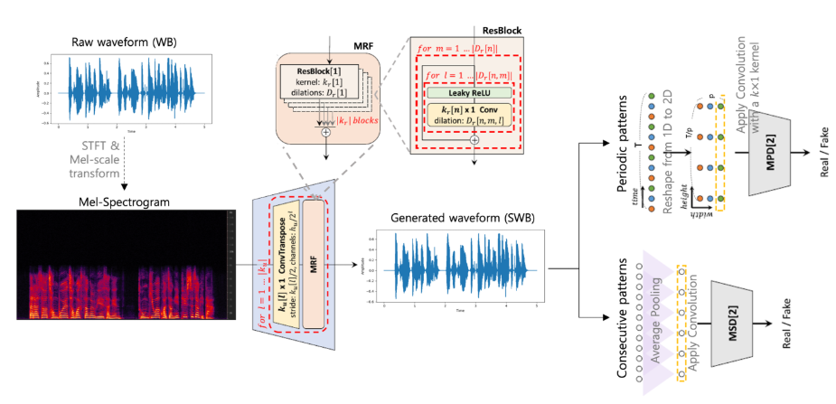
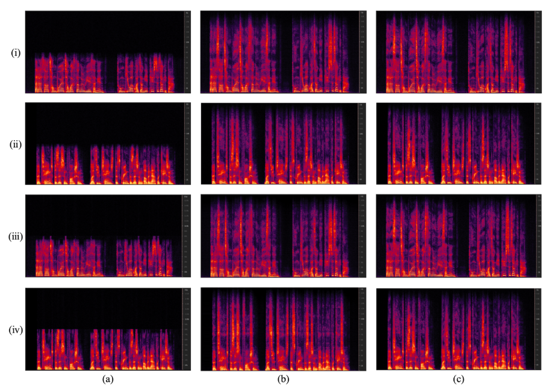

I developed a GAN-based bandwidth extension system using Hifi-GAN architecture, known as state-of-the-art in TTS vocoders. The model converts mel spectrograms from 16kHz wideband signals to 32kHz super-wideband audio through:

* **Generator**: Hierarchical upsampling with Multi-Receptive Field Fusion modules

* **Dual Discriminators**: Multi-Period and Multi-Scale discriminators for realistic audio generation

* **Transfer Learning**: Leveraged pre-trained TTS models for efficient training

  
  

    Overall architecture of proposed BWE model
  

### Result

MUSHRA evaluation demonstrated 30% improvement in perceptual quality scores compared to input wideband signals. The model showed excellent generalization to unseen speakers and effectively handled multiple codec artifacts, making it practical for real-world deployment.

  
  

    Each row represents spectrograms of speech signals corresponding to (i) BWE with seen speaker, (ii) BWE with unseen speaker, (iii) Multiple codec artifacts BWE with seen speaker, and (iv) Multiple codec artifacts with unseen speaker, respectively. Each column represents (a) input speech signal with 16kHz sampling rate, (b) results generated by the trained model, and (c) ground-truth speech signal with 32kHz sampling rate, respectively. The y-axis of each spectrogram shows the 0-16kHz range on a linear scale.
  

