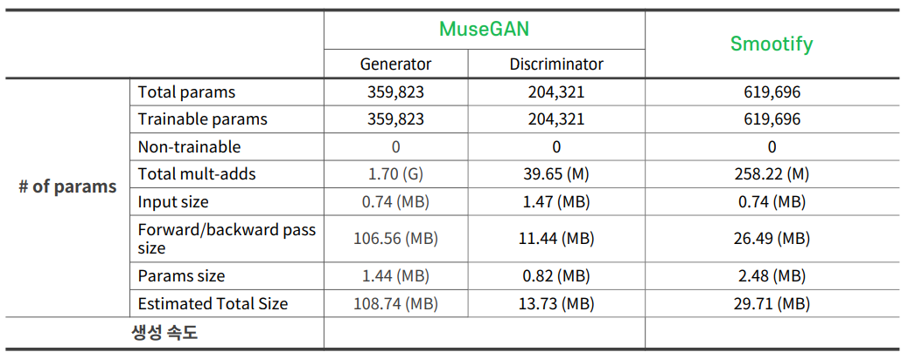
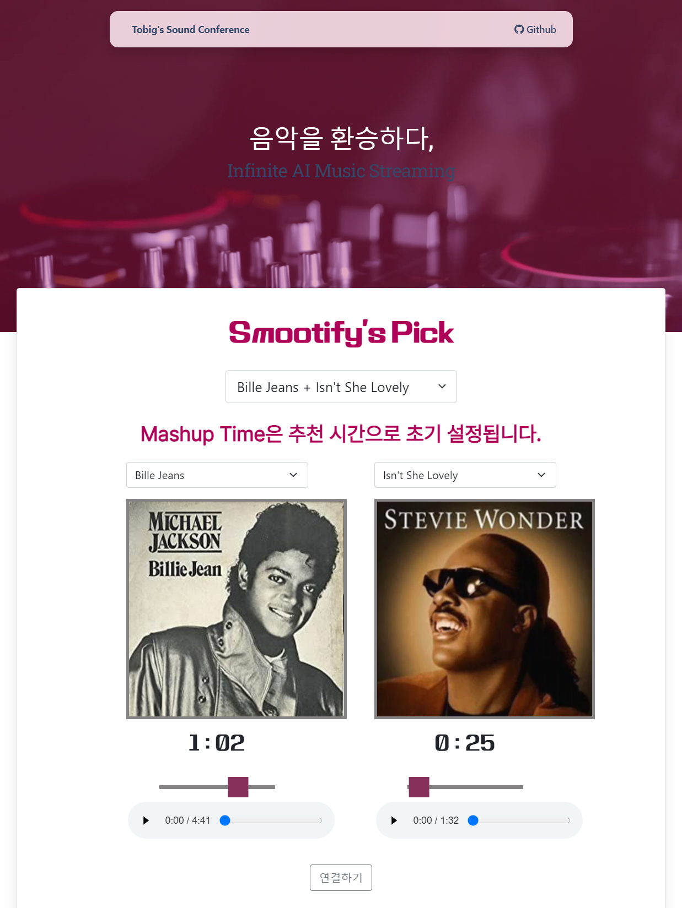

_Smootify_ is an **AI-driven music streaming** project designed to create seamless transitions between songs, enabling truly infinite music streaming experiences. By leveraging advanced **music generation** techniques, Smootify analyzes and connects two different pieces of music in a natural and musically coherent way. The system utilizes MIDI-format music data, specifically drawing from the Lakh Pianoroll Dataset based on the Million Song Dataset, to train its models.
  
For mashup point detection, Smootify employs Dynamic Time Warping (DTW) and distribution similarity methods to identify optimal mixing points between tracks. To generate smooth transitions, the project adapts convolutional structures from MuseGAN and incorporates a U-Net-based architecture, training the model to predict masked segments between two songs. This approach allows Smootify to generate high-quality, context-aware transitions, resulting in a continuous and enjoyable listening experience.

### Result

### Demo

The demo page is [here](https://smootify-tobigs1516.netlify.app/project) and code is [here](https://github.com/ToBigsSound-1516/Smootify).