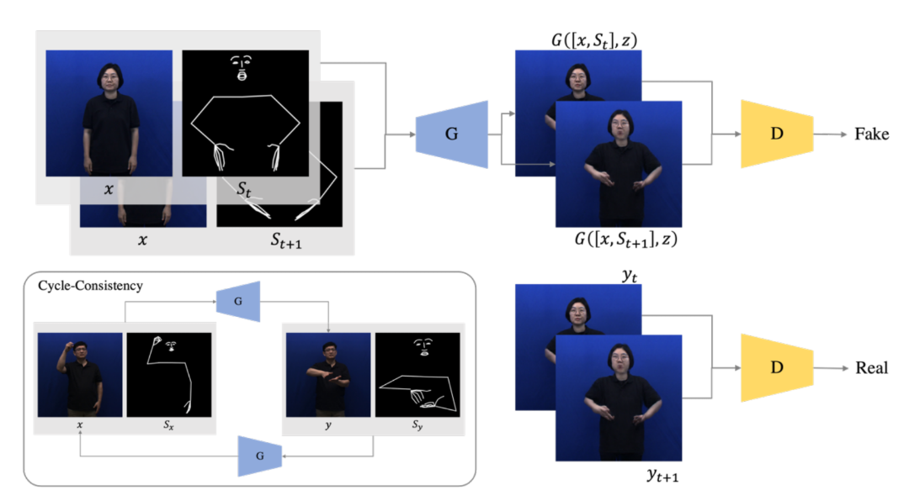
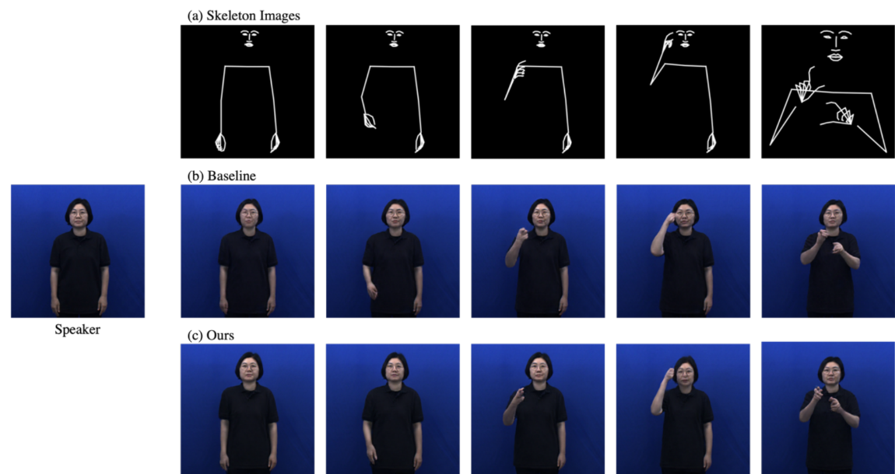

### Problem & Motivation
Traditional sign language interpretation displays interpreters in small corner windows, creating accessibility barriers for deaf viewers who must shift attention between the speaker and interpreter. According to Korea's National Institute of Korean Language, 53% of users cited "small screen size" as the primary barrier to understanding sign language interpretation.

### Architecture

Overall architecture of proposed model

* **Pose Extraction**: OpenPose library to extract 113 keypoints (54 facial, 50 hand, 9 body landmarks) as skeleton representations
* **Generator**: U-Net architecture with skip connections for detail preservation, taking speaker images and skeleton sequences as input
* **Discriminator**: PatchGAN architecture processing consecutive frame pairs for temporal consistency

### Results

Qualitative results

Qualitative evaluation showed superior results compared to GestureGAN baseline, with better facial feature preservation and finger detail accuracy. Training convergence was faster due to additional temporal frame information.