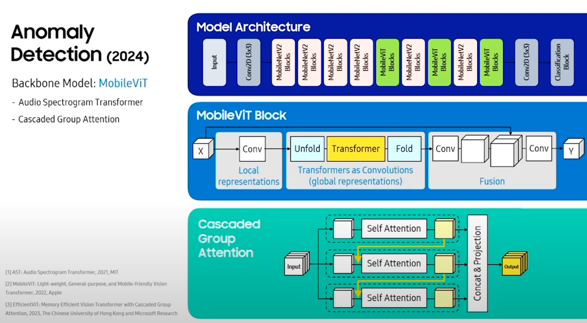
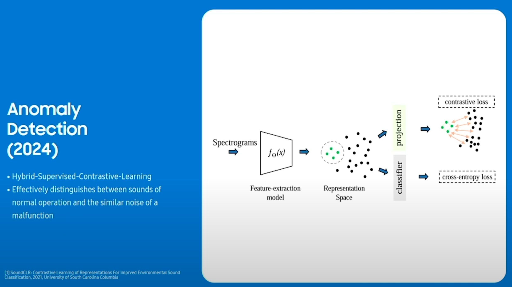

  <iframe width="560" height="315" src="https://youtube.com/embed/opsje6mc7CM?si=cc-X_uY9Lbvhbbs9&start=729" title="YouTube video player" frameborder="0" allowfullscreen></iframe>
  

    Official replay video of SDC 2024
  

### Problem & Real-World Impact
Sound-related complaints comprised large portion of customer Voice of Customer (VoCs), significantly impacting costs and satisfaction. While experts can diagnose appliance problems by listening to machine sounds, most users cannot distinguish between normal operation and malfunction sounds. The goal was to imitate this expert knowledge through AI-powered sound analysis integrated into Samsung's SmartThings ecosystem.

### Technical Solution

  

  

    Screenshots from the presentation video.
  

**Transformer Architecture**
* Patch-Based Processing: Spectrograms divided into patches for better temporal modeling
* Cascaded Group Attention: Split channels for efficient attention computation
* Bottleneck Structure: Optimized processing efficiency while maintaining accuracy

**Hybrid Contrastive Learning**
* Combined contrastive loss (increases distance between similar yet distinct features) with cross-entropy loss to better discriminate subtle variations in appliance sounds.