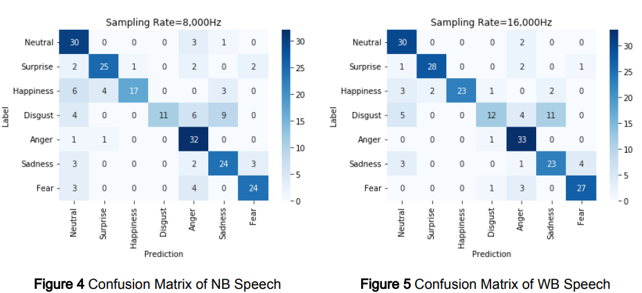
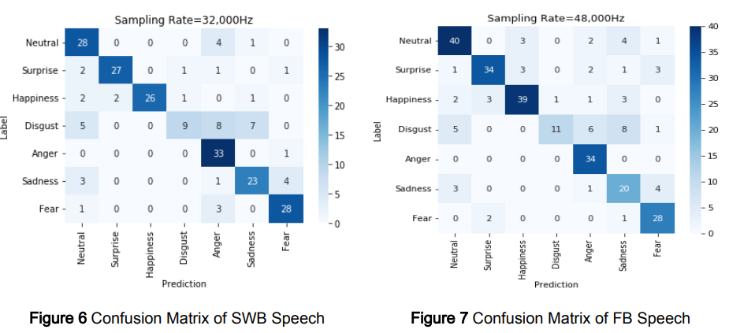
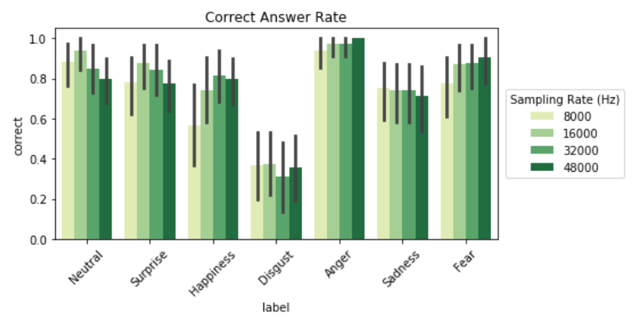
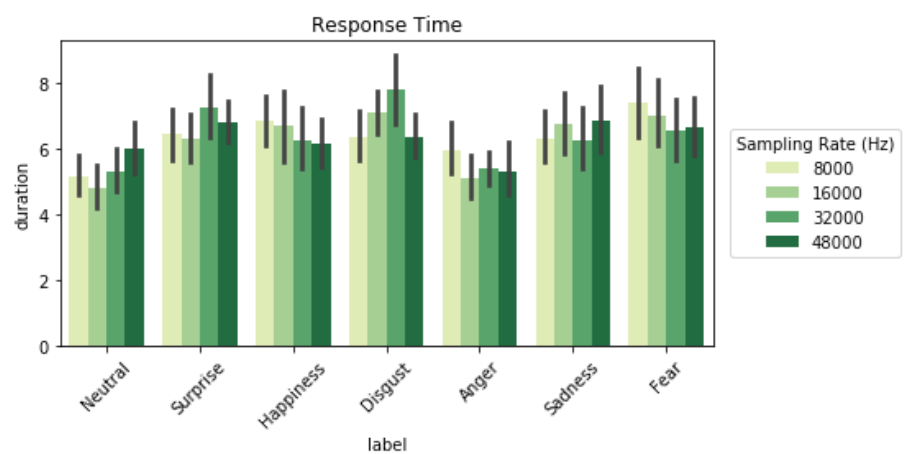

### Problem & Motivation
With the rise of digital communication accelerated by COVID-19 and metaverse technologies, speech signals frequently undergo bandwidth limitations during network transmission. While previous studies on Western languages showed degraded emotion recognition with reduced bandwidth, the impact on Korean speech remained unexplored.

### Research Design
I conducted an experiment with 18 participants who listened to Korean emotional speech across four bandwidth conditions: NB (4kHz), WB (8kHz), SWB (16kHz), and FB (24kHz). The study used professional actors expressing seven emotions (happiness, anger, disgust, fear, neutral, sadness, surprise) from the [KETI emotion dataset](https://aihub.or.kr/opendata/keti-data/recognition-visual/KETI-01-001).

### Result

Confusion matrixes

 

Emotion Recognition Accuracy

 

Response time

**Bandwidth Effects**
 
Bandwidth limitation had no statistically significant effect on emotion recognition accuracy or response time (p > 0.05). This contrasts with previous Western language studies, likely due to Korean having fewer fricatives that require high-frequency information and more limited prosodic variation compared to English.

**Emotion-Specific Patterns**
 
Emotion type significantly influenced recognition performance :
* **Anger**: Highest accuracy (Odds Ratio = 31.16) due to distinct vocal characteristics
* **Disgust**: Lowest accuracy (Odds Ratio = 0.53) and longest response times
* **Fear, Neutral, Surprise**: Moderate-to-high recognition rates

### Conclusion
This study provides empirical evidence that linguistic content preservation is sufficient for emotional communication in Korean speech, contradicting assumptions from Western language research. The findings suggest that multimodal approaches (combining audio with visual cues) may be necessary for emotions like disgust that are difficult to convey through voice alone.

### Resources
- Paper: [[KOR]](2022-emotion_report.pdf)